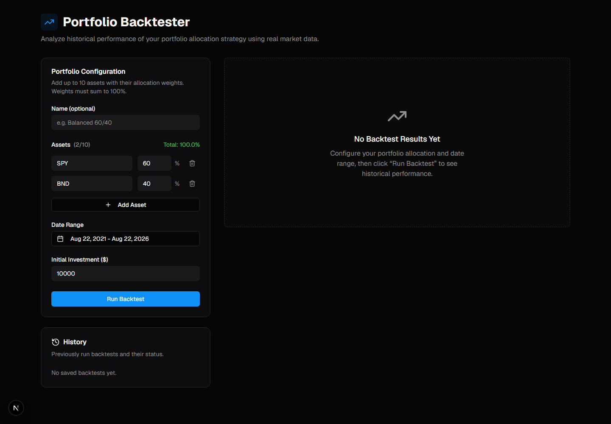
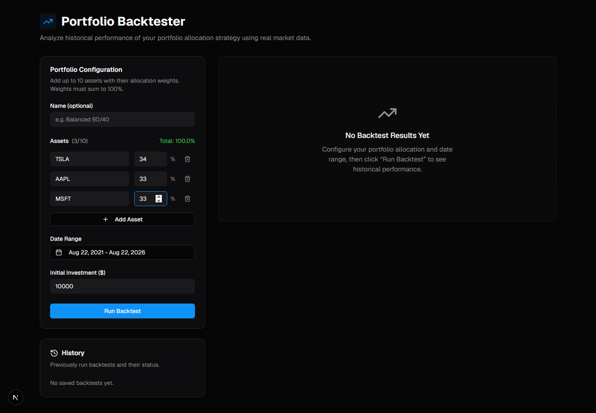
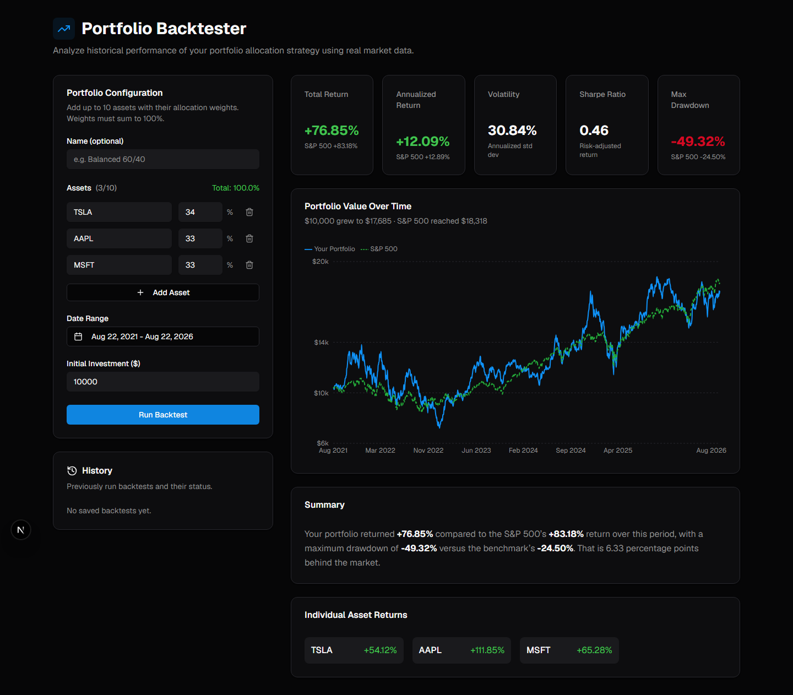
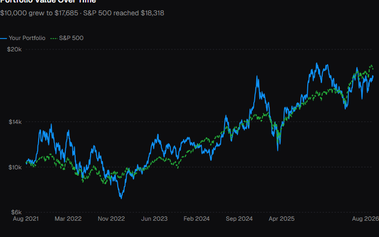

# Portfolio Backtester

A web app that answers one question for new investors: *if I had bought these
stocks on this date, what would have happened?* Enter up to ten US tickers and a
date range, and it fetches real historical prices, computes total return,
annualized return (CAGR), maximum drawdown and the Sharpe ratio, then charts your
portfolio against the S&P 500 so you can see whether the strategy actually beat
the market.

Built to make backtesting approachable for students and first-time investors, who
otherwise choose between $12,000-a-year institutional terminals and untested
advice from social media.

**Live demo:** _not yet deployed — see [Deployment](#deployment)_
**Demo video:** _to be added_

---

## Screenshots

### Landing page


### Input form with sample data


### Results dashboard


### Portfolio vs S&P 500 chart


---

## Features

- **1–10 US tickers** with optional custom weights, defaulting to equal weight
- **Four core metrics** — total return, annualized return (CAGR), maximum
  drawdown, Sharpe ratio — plus annualized volatility
- **S&P 500 benchmark** fetched and charted alongside every run
- **Interactive chart** with a crosshair tooltip showing both series and the gap
  between them
- **Plain-English summary** of how the portfolio did against the market
- **Client and server validation** — nothing reaches the network until the input
  is well formed
- **Provider fallback** so a rate-limited data source does not break a demo
- **Responsive** down to 375px

## Tech stack

| Layer | Technology |
|---|---|
| Framework | Next.js 16 (App Router), React 19 |
| Language | TypeScript, with the calculation core in plain CommonJS |
| Styling | Tailwind CSS 4, shadcn/ui, Radix primitives |
| Charts | Recharts |
| Data fetching | SWR |
| Testing | Jest |
| Market data | Alpha Vantage, Yahoo Finance |
| Optional storage | Supabase |
| Secondary API | Express (`server/`), sharing the same calculation modules |

## Getting started

### Prerequisites

- Node.js 18 or newer (`node --version`)
- npm

### Installation

```bash
git clone https://github.com/diagsharma/v0-stock-portfolio-analyzer.git
cd v0-stock-portfolio-analyzer
npm install
```

### Environment variables

Create a `.env.local` file in the project root:

```bash
# Required for the Alpha Vantage provider
ALPHA_VANTAGE_API_KEY=your_key_here

# Optional. Leave blank to run with no database at all.
NEXT_PUBLIC_SUPABASE_URL=
NEXT_PUBLIC_SUPABASE_ANON_KEY=
```

**Getting an Alpha Vantage API key**

1. Go to <https://www.alphavantage.co/support/#api-key>
2. Enter your email and click **GET FREE API KEY**
3. Copy the key into `ALPHA_VANTAGE_API_KEY`

The app still runs without a key — it falls back to Yahoo Finance, which needs no
credentials. See [Market data](#market-data) for why.

**Supabase is optional.** Saved history is not part of the core product; with
these variables blank the app runs normally and the History panel stays empty. If
you do want persistence, use the **anon / publishable** key, never the service
role key — it is exposed to the browser by the `NEXT_PUBLIC_` prefix. Run
`scripts/001_create_tables.sql` in the Supabase SQL editor first.

### Running

```bash
npm run dev     # http://localhost:3000
npm test        # 83 unit tests
npm run build   # production build
```

The standalone Express API is optional and runs separately:

```bash
cd server
npm install
npm start       # http://localhost:3001
```

## Usage

1. Open <http://localhost:3000>
2. Enter ticker symbols — 1 to 5 capital letters, e.g. `AAPL`, `TSLA`, `MSFT`
3. Adjust weights so they total 100%, or leave them equal
4. Pick a start and end date
5. Set an initial investment amount
6. Click **Run Backtest**

### Example

| Field | Value |
|---|---|
| Tickers | `TSLA` 34%, `AAPL` 33%, `MSFT` 33% |
| Date range | 2021-01-01 → 2023-12-31 |
| Initial investment | $10,000 |

Returns roughly +43.6% against the S&P 500's +34.7%, with a −46.4% maximum
drawdown against the benchmark's −24.5% — the portfolio beat the market, but
with far more pain along the way.

### API

```bash
curl -X POST http://localhost:3000/api/backtest \
  -H "Content-Type: application/json" \
  -d '{
    "tickers": ["AAPL", "MSFT", "TSLA"],
    "startDate": "2021-01-01",
    "endDate": "2023-12-31",
    "benchmark": "SPY",
    "initialInvestment": 10000
  }'
```

Responds with `metrics`, `benchmarkMetrics`, `portfolioReturns` and
`benchmarkReturns` (both rebased to 100), dollar-valued `portfolioHistory` and
`benchmarkHistory`, and per-ticker `assetReturns`.

An unknown symbol returns `400`:

```json
{ "error": "Ticker NOTREAL not found" }
```

## Market data

Alpha Vantage is the primary provider, with Yahoo Finance as an automatic
fallback.

The fallback is not decorative. As of August 2026 the free Alpha Vantage tier no
longer serves `outputsize=full` on `TIME_SERIES_DAILY`:

```json
{ "Information": "the outputsize=full parameter value is a premium feature for
  the TIME_SERIES_DAILY endpoint..." }
```

`outputsize=compact` returns only the most recent 100 trading days, which cannot
support a multi-year backtest. The data layer therefore requests Alpha Vantage
first, and when the response does not reach back far enough — or the daily quota
of 25 requests is exhausted — it falls back to Yahoo Finance, which returns full
daily history including adjusted close. The reason for each fallback is reported
on `fallbackReasons` rather than hidden.

Prices are cached in memory for an hour, so repeated backtests over the same
range cost no API calls.

`api_sample.json` holds a Yahoo daily response for AAPL over 2020–2023 (1006
records). `api_sample_alphavantage.json` holds an Alpha Vantage response showing
the 100-record limit.

## How the metrics are calculated

All of these live in [`backend/utils/calculations.js`](backend/utils/calculations.js)
as pure functions with no I/O, shared by the Next.js routes and the Express
server.

| Metric | Formula |
|---|---|
| Total return | `(endValue - startValue) / startValue × 100` |
| Annualized return (CAGR) | `((endValue / startValue) ^ (1 / years)) - 1` |
| Maximum drawdown | largest peak-to-trough decline, tracking a running maximum |
| Sharpe ratio | `(mean daily return - daily risk-free rate) / stdev × √252` |
| Volatility | `stdev(daily returns) × √252` |

The risk-free rate defaults to **2% annual**, divided by 252 trading days.
Portfolios are equal-weighted buy-and-hold unless custom weights are supplied,
and both the portfolio and the benchmark are rebased to 100 so they can share one
axis.

### A note on the brief's worked example

The project brief states that `calculateAnnualizedReturn` should return 15.87%
for $10,000 growing to $15,000 over three years. That figure is incorrect: the
CAGR is `(15000/10000)^(1/3) - 1 = 14.47%`, which is what Excel's
`=RATE(3,0,-10000,15000)` returns, and 15.87% would imply a holding period of
about 2.75 years. The implementation follows the formula, since the review
criteria require a correct CAGR. Documented rather than silently coded around.

## Testing

```bash
npm test
```

83 unit tests across the calculation core, input validation, and provider
selection and fallback. Providers are injected, so no test touches the network or
spends API quota.

### Verified scenarios

Each run below was checked against an independent calculation — for an
equal-weight buy-and-hold portfolio the total return must equal the mean of the
individual asset returns. Every case agreed to within 0.005 percentage points.

| # | Portfolio | Period | Points | Total Return | S&P 500 | Max DD | Sharpe | Time |
|---|---|---|---|---|---|---|---|---|
| 1 | AAPL | 2020–2023 | 1006 | +163.19% | +55.81% | −31.43% | 0.83 | 389ms |
| 2 | AAPL, MSFT, GOOGL | 2019–2023 | 1258 | +288.20% | +106.16% | −34.52% | 1.02 | 279ms |
| 3 | AAPL, MSFT, AMZN, META, NVDA | 2021–2022 | 503 | −15.43% | +6.79% | −48.68% | −0.12 | 265ms |
| 4 | TSLA, SPY | 2022 | 251 | −43.92% | −18.65% | −45.85% | −1.39 | 135ms |
| 5 | AAPL, MSFT | 2015–2023 | 2264 | +758.25% | +171.91% | −32.51% | 0.97 | 209ms |

All complete well inside the 10 second budget. Browser checks report zero console
errors and no horizontal overflow at a 375px viewport.

## Project structure

```
app/
  api/backtest/route.ts      POST — runs a backtest
  api/backtests/             GET / DELETE — optional saved history
  page.tsx                   main page
backend/
  services/
    alphaVantage.js          Alpha Vantage provider
    yahooFinance.js          Yahoo Finance provider
    marketData.js            provider selection, cache, parallel fetch
  utils/
    calculations.js          all financial maths
    validation.js            input rules
    errors.js                typed errors carrying HTTP status
components/                  React components, shadcn/ui in components/ui
server/index.js              standalone Express API
scripts/001_create_tables.sql  optional Supabase schema
```

## Deployment

The app deploys to Vercel as a single project — the API routes become serverless
functions automatically.

1. Push to GitHub
2. At <https://vercel.com/new>, import the repository
3. Add `ALPHA_VANTAGE_API_KEY` under **Environment Variables** (the Supabase
   variables are optional)
4. Click **Deploy**

Add the resulting URL to the top of this file.

## License

MIT
